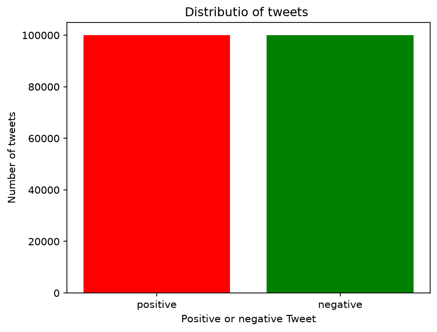
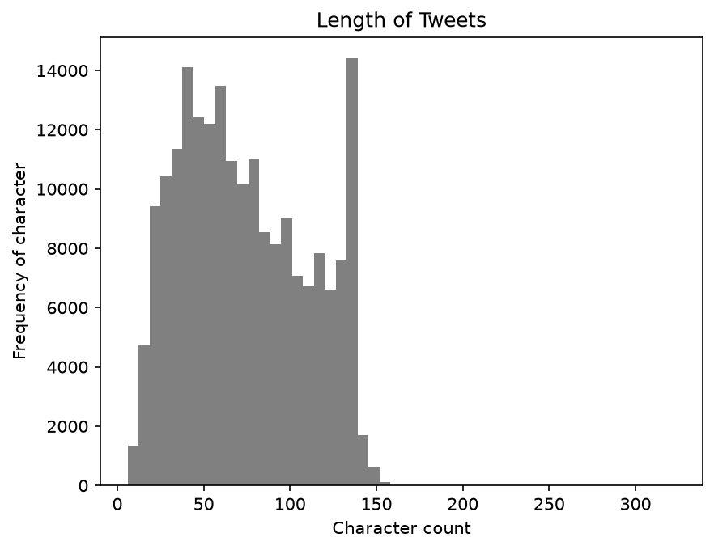
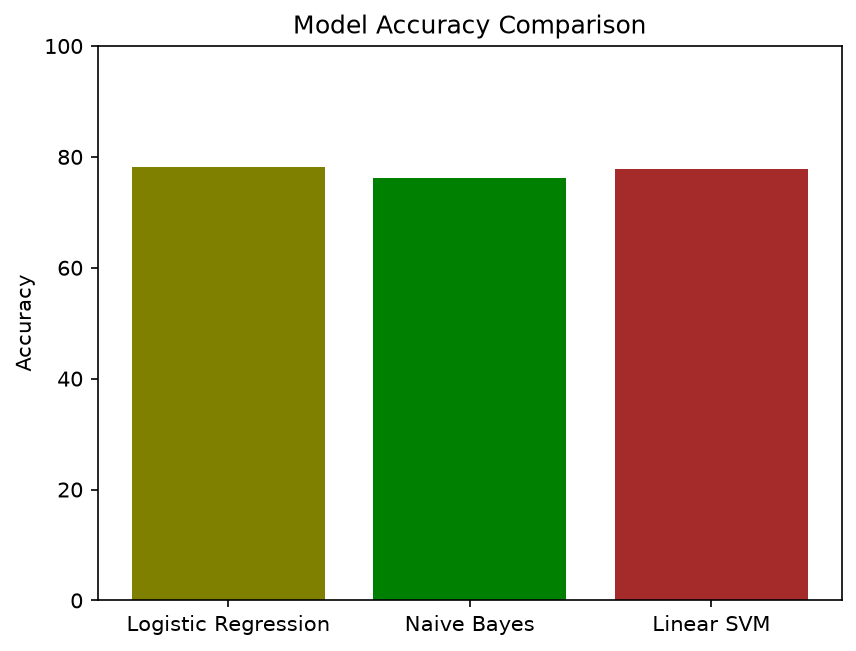
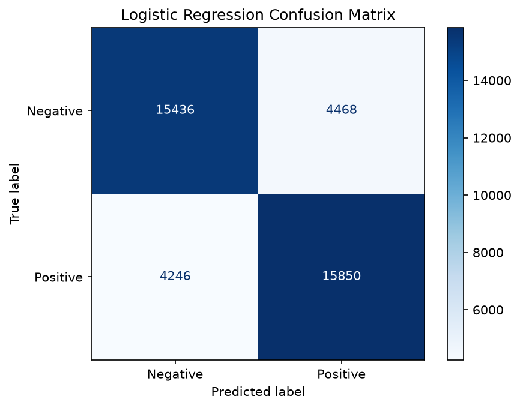
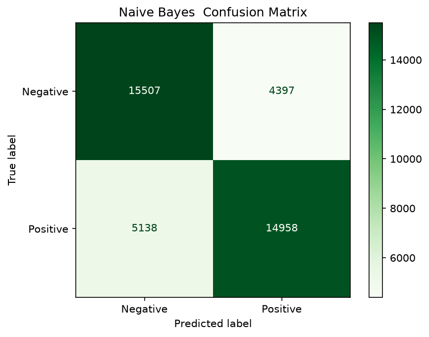
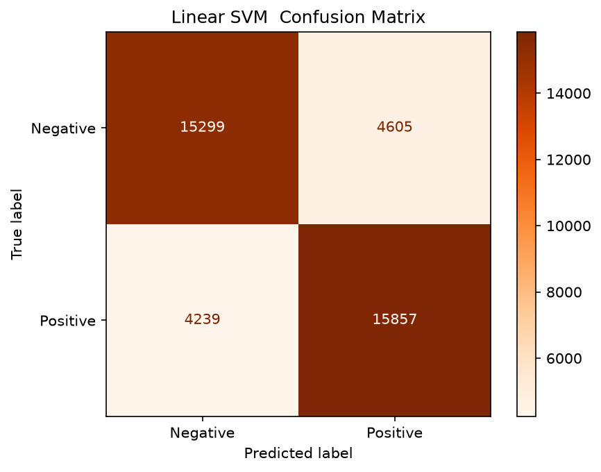
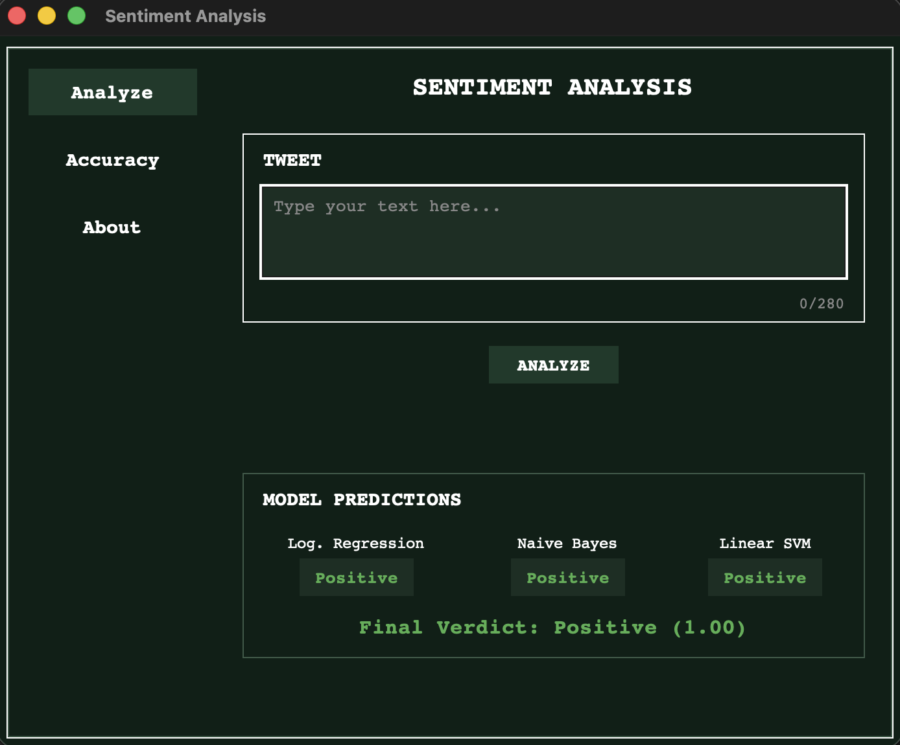

# Sentiment Analysis on Twitter Data


A machine learning project that predicts whether a tweet is **positive or negative**. I trained three different machine learning models, compared how they performed, and built a simple Tkinter GUI to make the predictions easier to use.

## Overview

The idea behind this project was to take a tweet as input and use machine learning to figure out its sentiment.

The tweets are first cleaned using basic text preprocessing. They are then converted into numerical features using **TF-IDF**, which allows the machine learning models to work with text data.

I trained three different models:

* Logistic Regression
* Multinomial Naive Bayes
* Linear SVM

Instead of depending on just one model, the application combines the predictions from all three models and gives a final sentiment based on their votes.

## Dataset

* **Dataset:** [Sentiment140](https://www.kaggle.com/datasets/kazanova/sentiment140)
* **Tweets used:** 200,000
* **Positive tweets:** 100,000
* **Negative tweets:** 100,000
* **Type:** Binary classification

The original Sentiment140 dataset contains around 1.6 million tweets. For this project, I used a balanced sample of 200,000 tweets so that both classes had the same number of examples.

## Exploratory Data Analysis

Before training the models, I did some basic analysis of the dataset to understand what the data looked like.

### Class Distribution

The dataset used for training is evenly split between positive and negative tweets.



### Tweet Length

I also looked at the distribution of tweet lengths. Most of the tweets are relatively short, which makes sense since the dataset comes from an older period when Twitter had a shorter character limit.



## Approach

The project follows these main steps:

1. **Explore the dataset** using Pandas and Matplotlib.
2. **Clean the tweets** by converting them to lowercase and removing URLs, mentions, punctuation, and unnecessary spaces.
3. **Convert text to numbers** using TF-IDF with the top 5,000 features.
4. **Train three models**:

   * Logistic Regression
   * Multinomial Naive Bayes
   * Linear SVM
5. **Evaluate the models** using accuracy scores and confusion matrices.
6. **Combine the predictions** from all three models to produce the final sentiment.

## Results

| Model               | Accuracy |
| ------------------- | -------: |
| Logistic Regression |    78.2% |
| Naive Bayes         |    76.2% |
| Linear SVM          |    77.9% |

All three models were tested using the same **20% test split**, containing 40,000 tweets.

Logistic Regression performed the best among the three models with an accuracy of **78.2%**.



### Confusion Matrices

#### Logistic Regression



#### Naive Bayes



#### Linear SVM



## Project Structure

```text
sentiment-analysis-project/
├── sentiment_analysis.ipynb   # Training, EDA, preprocessing and evaluation
├── predict_cli.py              # Terminal-based prediction tool
├── prediction_gui.py           # Tkinter GUI
├── log_model.pkl               # Logistic Regression model
├── nb_model.pkl                # Naive Bayes model
├── svm_model.pkl               # Linear SVM model
├── vectorizer.pkl              # Fitted TF-IDF vectorizer
├── images/                     # Project graphs and screenshots
└── .gitignore
```

## Running the Project

### 1. Set up the environment

Create a virtual environment and install the required libraries:

```bash
python3 -m venv venv
source venv/bin/activate

pip install numpy pandas matplotlib scikit-learn jupyter
```

### 2. Train the models

Open the notebook:

```text
sentiment_analysis.ipynb
```

Run the cells from top to bottom. This will perform the preprocessing, train the models, evaluate them, and generate the required `.pkl` files and graphs.

### 3. Run the CLI version

```bash
python predict_cli.py
```

This lets you enter a tweet directly in the terminal and see the predictions from the three models.

### 4. Run the GUI version

```bash
python prediction_gui.py
```

This opens the Tkinter application where you can enter a tweet and get the predictions through the graphical interface.

## GUI Preview

The GUI is a simple retro-style interface where you can enter a tweet and see what each model predicts.

It also shows the final combined verdict and has separate sections for model accuracy and information about the project.



## Notes

The original dataset is not included in this repository because of its size.

If you want to retrain the models from scratch, download the Sentiment140 dataset from Kaggle and place the CSV file in the project folder before running the notebook.

The project uses traditional machine learning rather than deep learning, so the models are relatively lightweight and can be trained on a normal computer.

## What I Learned

This project helped me understand the basic workflow of a text classification problem, from cleaning raw text and converting it into numerical features to training, evaluating, and using machine learning models.

I also got some hands-on experience with **Pandas, NumPy, Matplotlib, scikit-learn, TF-IDF, model evaluation, and Tkinter** while building the project.

---

**Built by GP**
